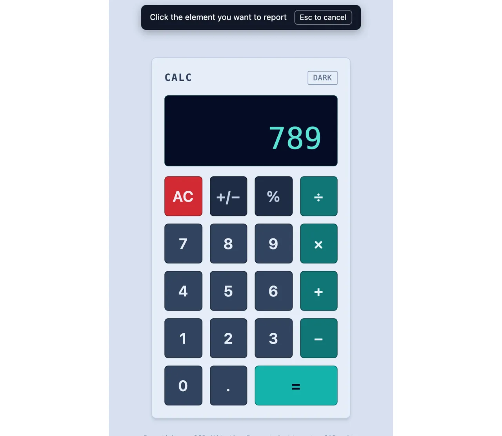
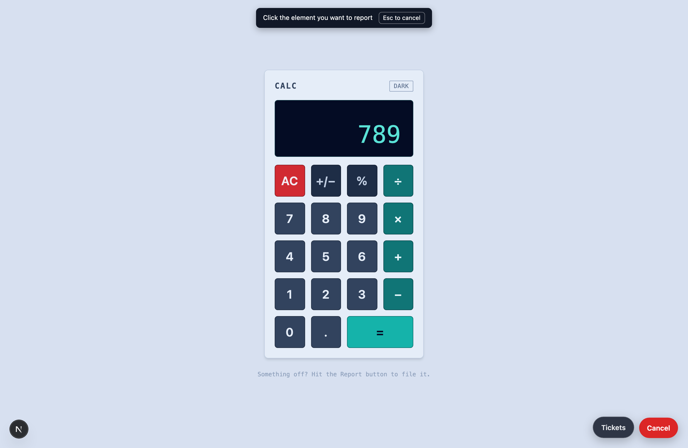
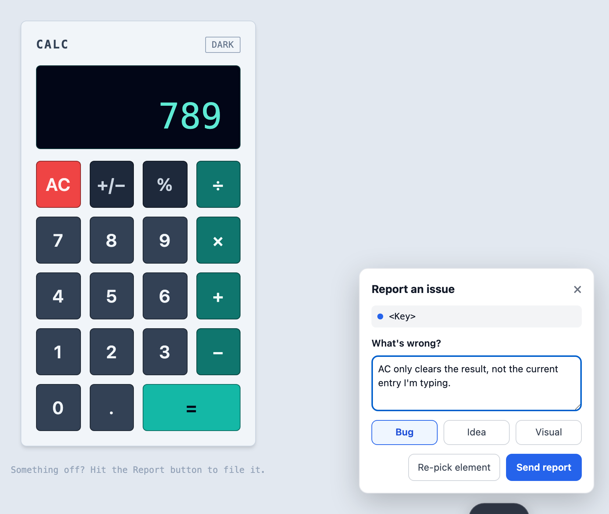
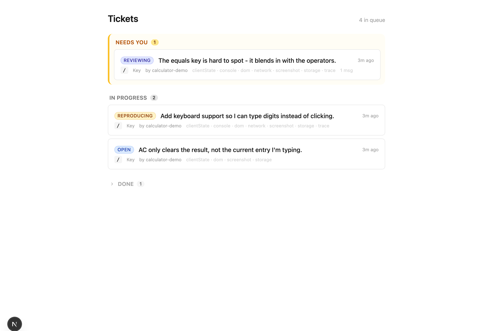
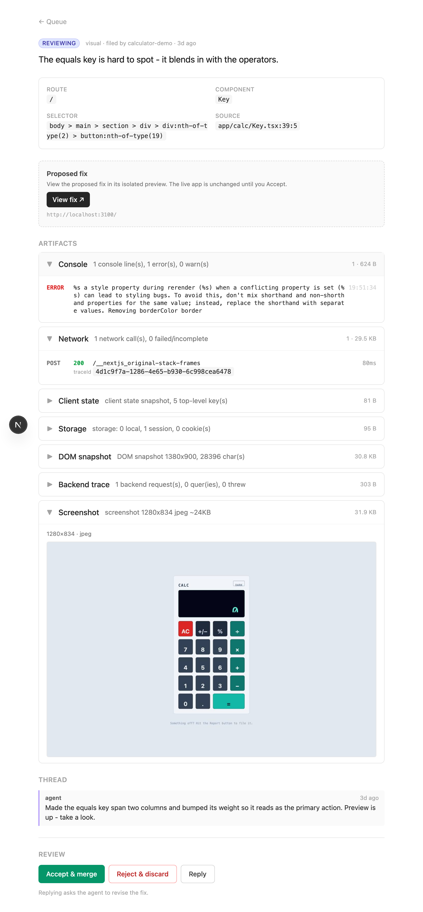

# paikko

*Walk the agent to the bug.*

The plumber's already in your house. You don't recite directions to the leak - you
walk them to it. paikko walks the agent to your bug: hit report and it lands on the
exact spot - element, route, state, trace.

A web framework for AI coding that flips the loop: instead of describing bugs to an
agent from the outside, you **use the app like a user**, hit a report button the moment
something's wrong, and the report - with full app state attached - lands in a ticket
queue the agent works through.

The agent doesn't live in the app. The **feedback loop** does: report, review, accept
or reject, all from inside the running app.

## See it

<p align="center">
  
</p>

<p align="center"><sub><b>Point</b> at whatever's wrong → <b>describe</b> it in a line → it <b>queues</b>, grouped by what needs you → <b>review</b> the agent's fix (exact source + every artifact), accept or reject. From the bundled <code>examples/calculator</code> demo.</sub></p>

<details>
<summary>Stills</summary>

| | |
|---|---|
|  |  |
|  |  |

</details>

## Thesis

Current AI coding (Lovable, v0, Claude Code, etc.) is outside-in: you see a problem in
the running app, switch to a chat, describe it from memory, the agent guesses. Context
is lost at the point of pain.

paikko captures context **at the point of pain**. The report button fires from inside
the app and bundles exact repro state - route, the DOM element you clicked, console,
network, client state, and a backend trace. The agent gets ground truth, not prose.

## Core pieces (v0)

1. **`<ReportButton>`** - captures route, DOM-click provenance (`data-src`), console
   ring buffer, last N network calls, client state, storage. Snapshot at click time.
2. **Mandated seams** - router, API handler wrapper (`withCapture()`), state store, and
   build-time provenance plugin. Only these are forced; everything else the agent does
   freely. The seams are what make capture *total* instead of best-effort.
3. **Ticket state machine** - the report/review loop, all through the in-app UI:
   ```
   open -> agent reproducing -> { repro failed -> needs-info }
                             -> fix proposed -> reviewing (parked, non-blocking)
                                             -> { accepted -> verify -> closed }
                                             -> { rejected + comment -> back to fix }
   ```
4. **Agent runner** - Claude Code in a loop. Polls for open tickets, pulls the bundle,
   fix-agent patches, verify-agent checks, opens a preview-per-ticket, posts back.
5. **CI seam guard** - mechanical check that fails if seams are bypassed (raw route
   handlers, state outside the store, provenance plugin stripped). Holds the line the
   prompt won't hold over 50 tickets.

## Stack

Wrapping a proven stack, not building our own - building the whole stack means debugging
the debugger. **Next.js + Prisma**, mandated state store, SWC/Babel provenance plugin.
Picked for the huge agent training base: the agent already knows Next, so it won't fight
the architecture. Drift is enemy #1; familiarity is the cheapest defense.

## The ticket bundle (the core contract)

Two-tier. The **head** loads into agent context every time; **artifacts** sit behind
refs the agent fetches only when a fix needs them. Each artifact carries a `summary` so
the agent decides from the head whether to fetch - most tickets solve with zero fetches.

Head: id, status, the user message, route, clicked-element provenance, thread, and an
artifacts index (ref + summary each). Artifacts (fetched by ref): console, network,
client state, storage, DOM snapshot, backend trace.

`traceId` stitches a frontend network entry to its backend handler + queries.
`src` appears on every layer (clicked element, API handler, each query) - provenance
end to end. Artifacts are **immutable**, captured once at report time - a photograph,
not a live window. Storage v0: JSONB rows keyed by ticket+name, served at
`GET /tickets/:id/artifacts/:name`.

## Deploying to Cloudflare Workers

paikko runs on Cloudflare Workers via [`@opennextjs/cloudflare`](https://opennext.js.org/cloudflare)
(OpenNext's adapter that runs Next.js app-router on Workers). The three stateful
pieces map to Cloudflare primitives:

- **Ticket store -> D1** (SQLite at the edge). The schema is already D1-safe
  (`status` is a `String`, payloads are JSON strings). Prisma talks to D1 through
  the `@prisma/adapter-d1` driver adapter; the D1 binding (`DB`) comes from the
  per-request Cloudflare context, not a connection string - so `@/lib/db` exposes
  `getPrisma()` (request-scoped) instead of a module singleton.
- **Backend trace buffer -> D1** (`TraceEntry` table). Workers isolates are
  ephemeral and the report POST may land in a different isolate than the one that
  captured, so the trace can't sit in process memory. `withCapture` appends each
  traced request to `TraceEntry` keyed by session; the report route drains the
  session's rows into the `trace` artifact. (D1 works under `next dev` too, where
  Durable Objects don't - so trace is the same path in dev and prod.)
- **The Next app -> the Worker** itself, built by OpenNext.

### Bindings (wrangler.jsonc)

| Binding  | Type        | Purpose                      |
|----------|-------------|------------------------------|
| `DB`     | D1 database | ticket store + trace (Prisma)|
| `ASSETS` | Assets      | static assets (OpenNext)     |

### One-time setup (on your Cloudflare account)

```bash
# 1. Create the D1 database, then paste the printed database_id into
#    wrangler.jsonc (replace REPLACE_WITH_D1_DATABASE_ID).
npx wrangler d1 create paikko

# 2. The initial migration is already generated at migrations/0001_init.sql
#    (via `prisma migrate diff --from-empty`). Apply it:
npx wrangler d1 migrations apply paikko --local    # local dev DB
npx wrangler d1 migrations apply paikko --remote    # production D1

# 3. Regenerate Cloudflare binding types after editing wrangler.jsonc:
npm run cf-typegen
```

To evolve the schema later: edit `prisma/schema.prisma`, create a new empty
migration file (`npx wrangler d1 migrations create paikko <name>`), then fill it
with `npm run d1:migrate:diff --output migrations/<file>.sql` (uses
`--from-local-d1` to diff against the current local D1 state), and apply with the
`d1:migrate:*` scripts.

### Build / preview / deploy

```bash
npm run preview   # opennextjs-cloudflare build + local wrangler preview (real D1 locally)
npm run deploy    # build + deploy to your Workers account
```

### Local dev story

- `npm run dev` (plain `next dev`) works for fast iteration. `next.config.js`
  calls `initOpenNextCloudflareForDev()`, which boots wrangler's local platform
  proxy so `getCloudflareContext()` resolves the `DB` binding against local D1
  state. Run the `--local` migration first so the local D1 has the tables. The
  whole report/trace path runs here (trace is D1, not a Durable Object), so most
  iteration needs nothing heavier.
- `npm run preview` runs the real OpenNext build under `wrangler dev` - the
  highest-fidelity local environment (real D1), closest to production.

### Caveats / known constraints

- **D1 has no interactive transactions.** The `@prisma/adapter-d1` adapter rejects
  `prisma.$transaction(async tx => ...)`, so the ticket store's status transitions
  are now read-then-write without a wrapping transaction. The state machine is
  still enforced (illegal edges throw before any write); the only weakened
  guarantee is atomicity against a concurrent racer, which the single serial v0
  runner does not hit.
- **Next.js 15 on `@opennextjs/cloudflare@1.x`.** The app runs Next 15.5 with the
  OpenNext 1.x adapter (which requires Next >= 15.5.18). Next 15 makes route
  `params`/`searchParams` and `headers()`/`cookies()` async, so dynamic route
  handlers and server components `await` them - already done across this repo.
  React stays on 18.3 (Next 15.5 supports both 18.x and 19.x; 18.3 is kept to
  minimise churn).

## Roadmap

- **v0**: capture widget, 4 mandated seams, ticket state machine, Claude Code loop, CI guard.
- **v1+**: replay-on-fix (recorded session becomes a regression test), record/bug-hunt
  session mode, normal-user reports (queued, not auto-acted), mobile/field reporting.
